# Tasks: Project & Unit Details Pages Update

**Feature**: specs/006-project-unit-details-update
**Generated**: 2026-08-28
**Total Tasks**: 41
**Files Modified**: 5 (frontend-only)

---

## Phase 1: Setup & Preparation

- [x] T001 Review existing `IconByName` component API to confirm it accepts `icon_name` prop in `resources/js/Components/UI/IconByName.jsx`
- [x] T002 Review existing translation keys for new labels (floor, finishing type, deal badge, payment terms) in `resources/js/Utils/locales/ar.js` and `resources/js/Utils/locales/en.js`

---

## Phase 2: Project Details Page — Critical Bug Fixes (Scenario 1, 3, 5, 6)

**File**: `resources/js/Pages/Public/Projects/Show.jsx`
**Story Goal**: Fix all broken buttons, remove fake data, and ensure every admin-entered field is properly displayed on the Project Details page.
**Independent Test**: Navigate to `/{locale}/projects/{slug}` → all buttons work, no fake features, no hardcoded data, map hidden when no coords, mobile layout has full data parity.

- [x] T003 [US1] Remove unused `AgentCard` import at line 9 in `resources/js/Pages/Public/Projects/Show.jsx`
- [x] T004 [US1] Fix duplicate mobile bottom bars (C1): Remove the first colliding fixed bar (L715-736 using raw `company_whatsapp`) and keep only the second bar (L788-808 using `agentContacts`). Change the kept bar's breakpoint to `md:hidden` for consistent mobile visibility in `resources/js/Pages/Public/Projects/Show.jsx`
- [x] T005 [US1] Fix fake features (C3): Replace hardcoded fallback amenities (swimming pool, gym, elevator, etc.) at L461-468 and L584-591 with conditional rendering — wrap both desktop and mobile `#features` sections in `{project.features?.length > 0 && (...)}` in `resources/js/Pages/Public/Projects/Show.jsx`
- [x] T006 [US1] Render dynamic feature icons (C4): Replace all hardcoded checkmark SVGs in the features grid with `<IconByName name={feature.icon_name} />` component for each feature, preserving the existing grid layout and styling in `resources/js/Pages/Public/Projects/Show.jsx`
- [x] T007 [US1] Fix map fallback to Cairo (C7): Add coordinate validation helper `const hasValidCoords = project.latitude && project.longitude && parseFloat(project.latitude) !== 0 && parseFloat(project.longitude) !== 0` — wrap both desktop map card (L516) and mobile map card (L619) in `{hasValidCoords && (...)}`, and add "Open in Google Maps" link to mobile map card in `resources/js/Pages/Public/Projects/Show.jsx`
- [x] T008 [US1] Fix hardcoded delivery year (C6): Replace hardcoded `2026` at L503 with `{project.delivery_date || '—'}` and conditionally hide the delivery row when `!project.delivery_date` in `resources/js/Pages/Public/Projects/Show.jsx`
- [x] T009 [US1] Fix finishing type hardcoded fallback (D6): Replace hardcoded 'سوبر لوكس'/'Super Lux' at L320 with `project.finishingType?.name || project.finishing_type?.name` and conditionally hide the finishing type badge when `!project.finishingType` in `resources/js/Pages/Public/Projects/Show.jsx`
- [x] T010 [US1] Fix project status hardcode (D8): Replace hardcoded "متاح للبيع / Available" at L507 with dynamic text based on actual project data or remove the hardcoded status badge entirely in `resources/js/Pages/Public/Projects/Show.jsx`
- [x] T011 [US1] Add payment terms to mobile layout (D1): Port the payment terms block from desktop overview (L413-431) into the mobile overview section (around L550), wrapped in the same `{['installment', 'both'].includes(project.payment_method) && (project.down_payment || project.installment_years)}` conditional in `resources/js/Pages/Public/Projects/Show.jsx`
- [x] T012 [US1] Add area name to mobile info card (D2): Include area name with link in the mobile info summary card section (L605-617) matching the desktop sidebar display in `resources/js/Pages/Public/Projects/Show.jsx`
- [x] T013 [US1] Fix nav tab conditional rendering (M2, M3): Wrap `#units-list` tab (L397) in `{projectUnitsList.length > 0 && ...}` and `#features` tab (L396) in `{project.features?.length > 0 && ...}` in the desktop anchor navigation bar in `resources/js/Pages/Public/Projects/Show.jsx`
- [x] T014 [US1] Add video_path support (D5): When `embedUrl` is null but `project.video_path` exists, render an HTML5 `<video controls>` element with `src={project.video_path}` wrapped in the same aspect-ratio container as the YouTube iframe, in both desktop and mobile video sections in `resources/js/Pages/Public/Projects/Show.jsx`

---

## Phase 3: Unit Details Page — Critical Bug Fixes (Scenario 2, 4, 5, 6)

**File**: `resources/js/Pages/Public/Units/Show.jsx`
**Story Goal**: Fix all broken buttons, remove fake data, add all missing admin data displays, and fix the broken mobile contact form on the Unit Details page.
**Independent Test**: Navigate to `/{locale}/units/{slug}` → all buttons work, contact form works with full validation on mobile, no fake features, floor/finishingType/deal badge visible, payment terms on mobile, map hidden when no coords.

- [x] T015 [US2] Fix duplicate mobile bottom bars (C2): Consolidate the two overlapping fixed bottom bars (L968-985 `md:hidden` price+contact bar and L1042-1061 `sm:hidden` WhatsApp+phone bar) into a single unified `md:hidden` mobile action bar showing price + WhatsApp + Phone in `resources/js/Pages/Public/Units/Show.jsx`
- [x] T016 [US2] Fix fake features (C3): Replace hardcoded fallback amenities at L542 (desktop) and L780 (mobile) with conditional rendering — wrap both `#features` sections in `{unit.features?.length > 0 && (...)}` in `resources/js/Pages/Public/Units/Show.jsx`
- [x] T017 [US2] Render dynamic feature icons (C4): Replace all hardcoded checkmark SVGs with `<IconByName name={feature.icon_name} />` in both desktop and mobile features grids in `resources/js/Pages/Public/Units/Show.jsx`
- [x] T018 [US2] Fix mobile contact form (C5): Add `id="contact-form"` attribute to the mobile contact form section (L849), add `client_email` input field matching desktop, add validation error displays for all 4 fields (`errors.client_name`, `errors.client_phone`, `errors.client_email`, `errors.content`), and add success banner (`sentSuccess || flash?.success`) matching desktop behavior in `resources/js/Pages/Public/Units/Show.jsx`
- [x] T019 [US2] Add validation errors to desktop contact form: Add missing `errors.client_phone` and `errors.client_email` inline error displays below their respective input fields in the desktop form section (around L590-610) in `resources/js/Pages/Public/Units/Show.jsx`
- [x] T020 [US2] Fix map fallback to Cairo (C7): Add coordinate validation — wrap both desktop map card (L710) and mobile map card (L834) in `{hasValidCoords && (...)}` using the same validation pattern as Project page in `resources/js/Pages/Public/Units/Show.jsx`
- [x] T021 [US2] Add `floor` to quick specs grid (D2): Add a floor number row with floor/building icon to the specifications grid (around L362-396) — display `unit.floor` with label "الطابق / Floor", conditionally hidden when `unit.floor == null` in `resources/js/Pages/Public/Units/Show.jsx`
- [x] T022 [US2] Add `finishingType` display (D3): Add a finishing type badge/tag (e.g. "نوع التشطيب: سوبر لوكس") to the specs summary area or the quick specs section, reading from `unit.finishingType?.name || unit.finishing_type?.name`, hidden when null, in `resources/js/Pages/Public/Units/Show.jsx`
- [x] T023 [US2] Add `is_deal` badge (D4): Add a "صفقة مميزة / Hot Deal" badge overlay on the main photo (near the transaction badge at L174-176) when `unit.is_deal === true`, using amber/gold styling consistent with DESIGN.md featured badge tokens in `resources/js/Pages/Public/Units/Show.jsx`
- [x] T024 [US2] Add payment terms to mobile layout (D1): Port the payment terms block from desktop overview (L495-513) into the mobile overview section (around L745-753), wrapped in the same conditional check in `resources/js/Pages/Public/Units/Show.jsx`
- [x] T025 [US2] Add area card to mobile layout (D7): In the mobile layout section (around L803-831), add an else-if branch for `unit.area` when `!unit.project` — render the "Explore Properties in this Area" card with link to `/{locale}/areas/{slug}` matching the desktop sidebar behavior in `resources/js/Pages/Public/Units/Show.jsx`
- [x] T026 [US2] Fix nav tab rendering (M3): Wrap `#features` tab (L475) in `{unit.features?.length > 0 && ...}` in the desktop anchor tab bar in `resources/js/Pages/Public/Units/Show.jsx`
- [x] T027 [US2] Fix video anchor on mobile (M4): Update the "Watch Video" button overlay (L218-227) to use `onClick` with `document.getElementById(window.innerWidth >= 1024 ? 'video' : 'video-mob')?.scrollIntoView({behavior: 'smooth'})` instead of a plain `href="#video"` anchor in `resources/js/Pages/Public/Units/Show.jsx`
- [x] T028 [US2] Add video_path support (D5): When `embedUrl` is null but `unit.video_path` exists, render an HTML5 `<video controls>` element in both desktop and mobile video sections, matching the same aspect-ratio container pattern in `resources/js/Pages/Public/Units/Show.jsx`

---

## Phase 4: Translation Keys

- [x] T029 Add any missing translation keys for new UI labels (floor "الطابق"/"Floor", finishing type "نوع التشطيب"/"Finishing Type", deal badge "صفقة مميزة"/"Hot Deal", payment method labels) to `resources/js/Utils/locales/ar.js` and `resources/js/Utils/locales/en.js` — only if not already present

---

## Phase 5: Build & Final Verification

- [x] T030 Run `npm run build` and verify zero build errors, then manually test both pages in AR (RTL) and EN (LTR) at mobile (390px), tablet (768px), and desktop (1440px) viewports — confirm no console errors, no layout breaks, and all buttons functional

---

## Dependencies

```mermaid
graph TD
    T001[T001: Review IconByName] --> T006[T006: Project feature icons]
    T001 --> T017[T017: Unit feature icons]
    T002[T002: Review trans keys] --> T029[T029: Add trans keys]

    subgraph "Phase 2: Project Show.jsx"
        T003[T003: Remove import]
        T004[T004: Fix mobile bars]
        T005[T005: Fix fake features]
        T006[T006: Feature icons]
        T007[T007: Fix map fallback]
        T008[T008: Fix delivery date]
        T009[T009: Fix finishing type]
        T010[T010: Fix status hardcode]
        T011[T011: Mobile payment terms]
        T012[T012: Mobile area name]
        T013[T013: Fix nav tabs]
        T014[T014: Video path support]
    end

    subgraph "Phase 3: Unit Show.jsx"
        T015[T015: Fix mobile bars]
        T016[T016: Fix fake features]
        T017[T017: Feature icons]
        T018[T018: Fix mobile form]
        T019[T019: Desktop form errors]
        T020[T020: Fix map fallback]
        T021[T021: Add floor spec]
        T022[T022: Add finishing type]
        T023[T023: Add deal badge]
        T024[T024: Mobile payment terms]
        T025[T025: Mobile area card]
        T026[T026: Fix nav tabs]
        T027[T027: Fix video anchor]
        T028[T028: Video path support]
    end

    T014 --> T030[T030: Build & verify]
    T028 --> T030
    T029 --> T030
```

## Parallel Execution Opportunities

### Within Phase 2 (Project Show.jsx)
All tasks T003–T014 operate on the same file but target independent, non-overlapping code sections. They can be executed sequentially in a single pass through the file, but T006 depends on T001 (IconByName verification).

### Between Phase 2 and Phase 3
Phase 2 and Phase 3 target different files (`Projects/Show.jsx` vs `Units/Show.jsx`) and can be executed in **full parallel** by two agents.

### Parallel pairs within Phase 3 (Unit Show.jsx)
- T015 (bottom bars) ↔ T018 (contact form) — different code regions
- T021 (floor spec) ↔ T022 (finishing type) ↔ T023 (deal badge) — different code regions
- T024 (mobile payment) ↔ T025 (mobile area card) — adjacent but independent sections

---

## Implementation Strategy

### MVP Scope (User Story 1 — Project Details)
Complete Phase 1 + Phase 2 first. This delivers:
- All Project Details buttons working
- No fake data or hardcoded values
- Full mobile/desktop data parity
- Map only shown with valid coordinates

### Full Scope (User Story 1 + 2)
Complete Phase 1 through Phase 5. Adds:
- All Unit Details buttons working
- Complete mobile contact form with validation
- Floor, finishing type, and deal badge displays
- Full mobile/desktop data parity for units
- Video path (uploaded MP4) support
- Build verification

---

## Phase 6: Post-Implementation Audit Fixes (Refactoring & Polish)

**Files**: 
esources/js/Pages/Public/Projects/Show.jsx, 
esources/js/Pages/Public/Units/Show.jsx, 
esources/js/Pages/Public/Home.jsx, 
esources/js/Components/UI/PaymentTerms.jsx, 
esources/js/Components/UI/VideoPlayer.jsx, 
esources/js/Utils/location.js
**Goal**: Apply code review feedback, fix design system violations, remove scope creep, improve animations, and fix the home page search bar.

- [x] T031 [Refactor] Fix feature icon colors (FR-6.1): Change 	ext-[#CC0000] to 	ext-[#FF6B6B] (Coral Accent) in the <IconByName> feature grid in both Projects/Show.jsx and Units/Show.jsx.
- [x] T032 [Refactor] Extract hasValidCoords (FR-6.2): Abstract coordinate validation into 
esources/js/Utils/location.js and use in both Show pages.
- [x] T033 [Refactor] Extract PaymentTerms component (FR-6.2): Created 
esources/js/Components/UI/PaymentTerms.jsx and used for desktop/mobile in both Show pages.
- [x] T034 [Refactor] Extract VideoPlayer component (FR-6.2): Created 
esources/js/Components/UI/VideoPlayer.jsx and used in both Show pages.
- [x] T035 [Fix] Contact Form Success Reset (FR-6.3): In Units/Show.jsx, added onSuccess: () => reset() and a 7-second timer to auto-hide the success banner.
- [x] T036 [Fix] Contact Form Inline Errors (FR-6.3): In Units/Show.jsx desktop form, added validation error displays {errors.client_name} and {errors.content}.
- [x] T037 [Fix] Unit Type Tag (FR-6.3): In Units/Show.jsx, added unit.type?.name to the quick specifications grid.
- [x] T038 [Fix] Contact Agent Smooth Scroll (FR-6.3): Changed "Contact Agent" button to use onClick with .scrollIntoView({ behavior: 'smooth' }).
- [x] T039 [Scope] Remove Unintended Features (FR-6.4): Removed HTML5 ideo_path rendering, removed delivery_date and is_active from Projects, removed is_deal badge from Units.
- [x] T040 [Polish] Animation & Motion (FR-6.5): Replaced 	ransition-all with 	ransition-colors on form inputs; added 	ransition active:scale-[0.97] duration-150 ease-out on buttons and action links.
- [x] T041 [Fix] Home Page Search Bar (FR-6.6): In 
esources/js/Pages/Public/Home.jsx, fixed props passed to <SearchBar> from initialAreas to reas, etc., and made SearchBar.jsx resilient to both conventions.
